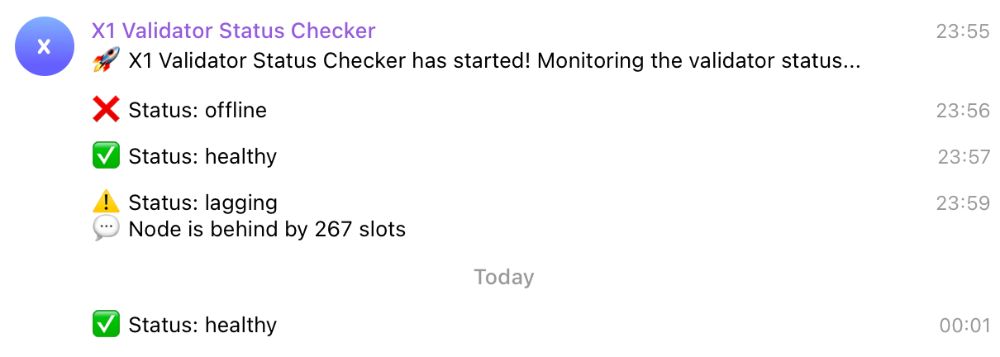

# X1 Validator Status Checker – Real-Time Monitoring & Telegram Alerts

The application provides an HTTP API (`/status`) to access the current status of the validator and sends notifications about the validator's health to Telegram, including individual users and Telegram channels.

## 📌 Features

- Fetches the current validator slot.
- Fetches the finalized slot.
- Fetches the current block hash for the validator's slot.
- Monitors WebSocket connection to the validator.
- Tracks application uptime.
- Checks if the validator is lagging behind (based on slot lag).
- Returns a status of the validator (`healthy`, `lagging`, or `offline`).
- Sends Telegram notifications when the validator status changes.

---

## 🚀 Installation

### 1️⃣ Clone the repository
```sh
git clone https://github.com/mattkrupnik/status.git
```

### 2️⃣ Navigate into the project directory
```sh
cd status
```

### 3️⃣ Install dependencies
> **Node.js is required to run this application.**
```sh
npm install
```

### 4️⃣ Copy and configure the environment file
```sh
cp .env.sample .env
```
You can modify `.env` values as needed:
```ini
PORT=3340
RPC_URL=http://localhost:8899
WS_URL=ws://localhost:8900
LOCAL_HOST=localhost

# Telegram configuration
TELEGRAM_BOT_TOKEN=example:1234567890
TELEGRAM_CHAT_ID=12345667890
TELEGRAM_API_URL=https://api.telegram.org/bot

# Notification interval
CHECK_INTERVAL=10000
```
### 5️⃣ Environment Variable Descriptions
- `PORT`: The port on which the server will run.
- `RPC_URL`: The RPC URL of the validator to monitor.
- `WS_URL`: The WebSocket URL for the validator.
- `LOCAL_HOST`: The host of the application.
- `TELEGRAM_API_URL`: The Telegram Bot API URL
- `TELEGRAM_BOT_TOKEN`: The bot token you get from BotFather.
- `TELEGRAM_CHAT_ID`: The chat ID where messages will be sent.
- `CHECK_INTERVAL`: How often to check the validator's status (in milliseconds).
### 6️⃣ Allow access to the application port
```sh
sudo ufw enable
sudo ufw allow 3340/tcp
sudo ufw reload
```

### 7️⃣ Run the application
```sh
pm2 start status.js --name validator-status
```
👉 You can customize the name instead of `validator-status`.

### 8️⃣ Save the PM2 process list and enable auto-start
```sh
pm2 save
pm2 startup
```
The server will start on the specified port (default: 3340).

---

## 🛑 Stopping and Managing the Application

- Stop the application:
  ```sh
  pm2 stop validator-status
  ```
- Restart the application:
  ```sh
  pm2 restart validator-status
  ```
- Delete the application from PM2:
  ```sh
  pm2 delete validator-status
  ```
- Check logs:
  ```sh
  pm2 logs validator-status
  ```
- List all running PM2 applications:
  ```sh
  pm2 list
  ```

---

## 🔔 Telegram Notifications

### 🏗 Create a Telegram Bot
1. Open Telegram and search for **BotFather**.
2. Send the command `/newbot` to create a new bot.
3. Follow the instructions to get your bot's **token**.
4. Save the token in `.env` under `TELEGRAM_BOT_TOKEN`.

### 🔍 Get Your Telegram Chat ID
1. Start a conversation with your bot in Telegram.
2. Use the following URL to get your **chat ID**:
   ```sh
   https://api.telegram.org/bot<Your-Bot-Token>/getUpdates
   ```
3. In the response, look for the `chat` field. The `id` inside `chat` is your chat ID.

### 📡 Set Up Telegram Alerts
- ⚠️ **Status: Lagging** – If the validator is behind too many slots.
- ✅ **Status: Healthy** – If the validator is synced and healthy.
- ❌ **Status: Offline** – If the validator is unresponsive or offline.



---

## 📡 API

### `GET /status`
Fetch the current status of the validator.

#### 📋 Response Example
```json
{
    "status": "healthy",
    "message": "Node is behind by 276 slots'",
    "processedSlot": 53941760,
    "finalizedSlot": 53941765,
    "confirmedSlot": 53941765,
    "uptime": "54h 10m 45s",
    "websocket": "connected"
}
```

**Fields:**
- `status` – The health status (`healthy`, `lagging`, `offline`).
- `message` – Description of the validator’s status.
- `validatorSlot` – The current validator slot.
- `finalizedSlot` – The latest finalized slot.
- `confirmedSlot` – The latest confirmed slot.
- `uptime` – How long the application has been running.
- `websocket` – Connection status (`connected`, `disconnected`).

---

## 🔄 WebSocket Connection

The application will attempt to connect to the WebSocket URL specified in `.env`. If disconnected, it will retry every **5 seconds**.

---

## 🔧 Troubleshooting

- **Port and Firewall Issues** – Ensure the PORT in `.env` is open and accessible (`ufw allow`).
- **WebSocket Issues** – Ensure `WS_URL` is correct and accessible. The app will retry every **5 seconds** if disconnected.

---

## 🤝 Contributing

We welcome contributions! 🎉

1. Fork the repository.
2. Create a new branch (`git checkout -b feature-branch`).
3. Make your changes and commit (`git commit -m "Added new feature"`).
4. Push the branch (`git push origin feature-branch`).
5. Open a Pull Request.

For questions, feel free to open an issue. 🚀

---